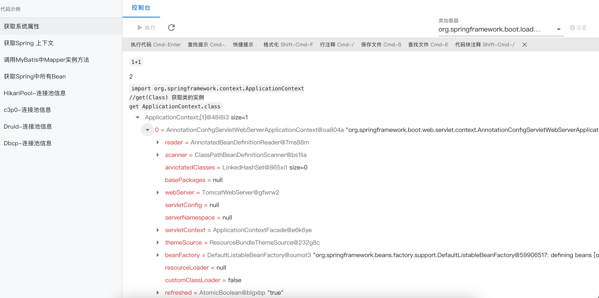

## 概述

这是一个Java开发者控制台，类似前端的Chrome的开发者控制台，可以执行任意java代码。

其原理是在jvm进程中基于javaagent方式注入一个WEB管理后台，并接收运行groovy脚本。

## 启动方式

1.启动加载器

`java -jar jcat-boot.jar`

2.选择目标jvm应用

## 常见问题

**找不到tools.jar包**

`java.lang.NoClassDefFoundError: com/sun/tools/attach/AttachNotSupportedException`
原因：该问题发生在jdk8，原因是%JAVA_HOME%/lib/tools.jar包不存在
解决办法：去oracle官网下载一个jdk8并把tools.jar复制到%JAVA_HOME%/lib/ 或%JAVA_HOME%/jre/lib/ext/ 目录中。

**连接attach目标虚拟机失败**

应用权限不够，改用管理员方式启动 `sudo java -jar jcat-boot.jar`

